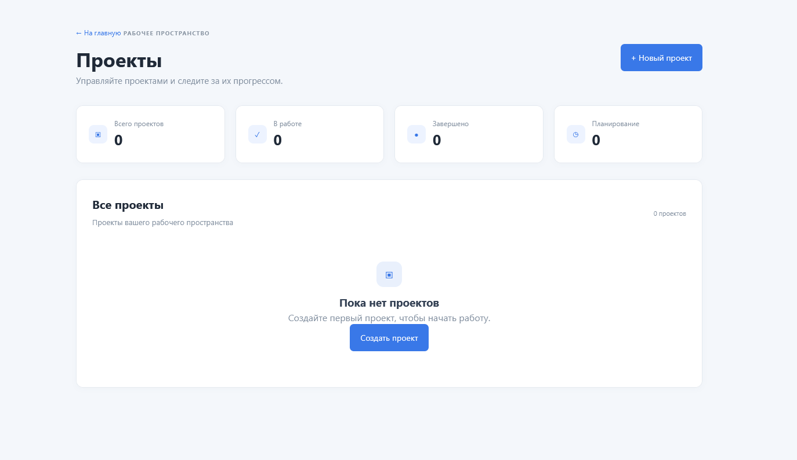
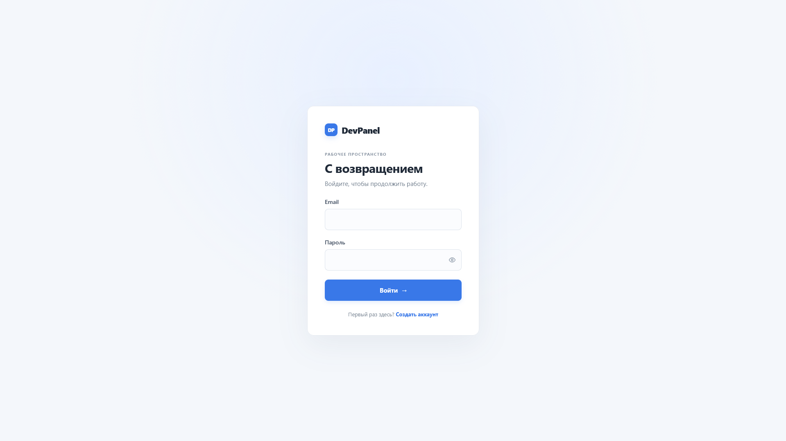

# DevPanel

### Проекты, задачи и прогресс — в одном рабочем пространстве

Панель управления, которая помогает собрать текущую работу в одном месте и быстро увидеть, что происходит.

[Открыть сайт ↗](https://devpanel.kesug.com) · [Исходный код ↗](https://github.com/xirsoev/DevPanel)

> **Демо-проект:** сайт создан для демонстрации. Возможны ошибки, временная недоступность и неисправности отдельных функций.

## О проекте

DevPanel — веб-приложение для управления проектами и рабочими задачами. Главная панель показывает общую картину: состояние проектов, текущую активность и прогресс.

## Возможности

- сводка по проектам, задачам и клиентам;
- создание проектов и просмотр их деталей;
- статусы, сроки и индикаторы выполнения;
- учётная запись администратора и защищённая авторизация;
- адаптивный интерфейс со светлой темой.

## Технологии

`PHP` · `MySQL` · `PDO` · `HTML` · `CSS` · `JavaScript`

## Другие экраны

